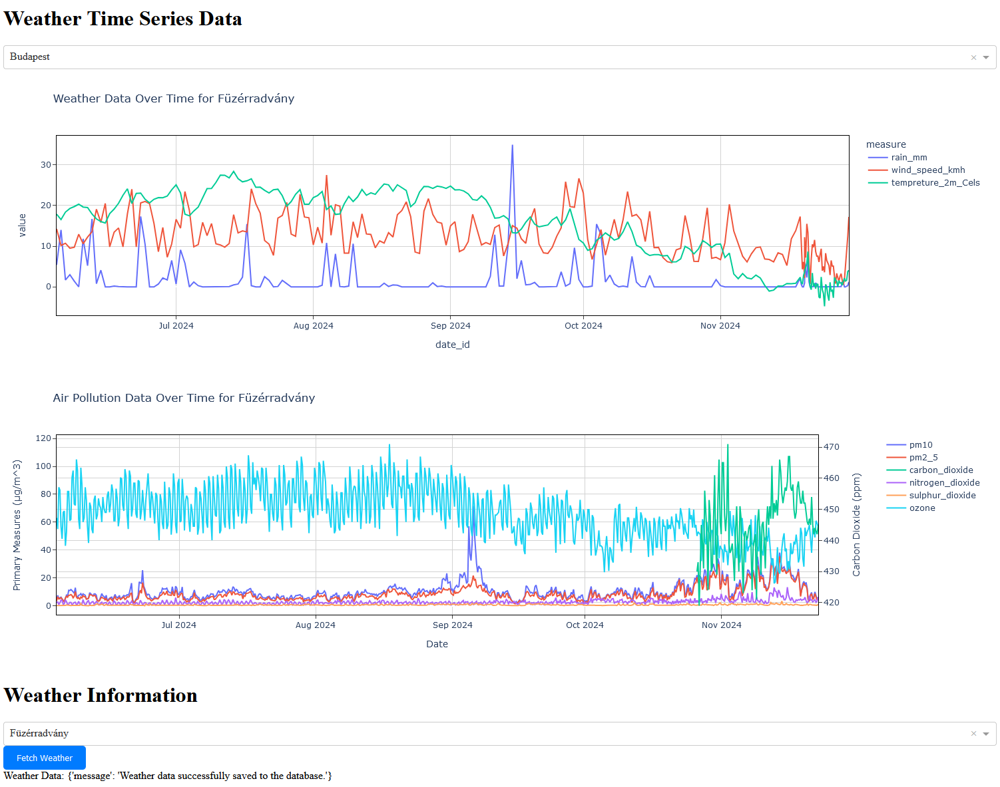

# Project Overview

This project provides historical and forecast weather data (rainfall, temperature, wind) and air quality indices (e.g., ozone, CO₂) for selected cities. Users can choose from various Hungarian cities, and the application displays relevant weather and air quality data for the chosen location. 

# How to Run
The project is conatinerized. One requirement is to have [docker](https://www.docker.com/products/docker-desktop/) installed on your system. When It's installed and running you should write the following lines to the command line:
```
cd src
docker compose up --build -d
```
First cd into the directory where the docker-compose.yml is stored. Then run the containers. The `-d` is optional to run in distributed mode. This command will build the neccesary containers and run the app.
If you use my configuration the APP will be reachable with the IP: http://localhost:8050/

# Project Architecture

The application uses a **microservice architecture** with three primary microservices:

1. **Database Service**:  
   A PostgreSQL database stores all the weather and air quality data in a tabular format.
2. **API Fetcher Service**:  
   Fetches weather and air quality data from [Open-Meteo](https://open-meteo.com/en/docs). This service includes an API that enables communication with other components.

3. **UI Service**:  
   A Python Dash-based interface displays the data and allows users to interact with the system. The UI communicates with the API Fetcher Service to request and display data.

## Microservices Structure

Each microservice is containerized using **Docker**. Each module contains its own `Dockerfile` and `requirements.txt` file. A root directory (`src`) contains the `docker-compose.yml` file to orchestrate all containers. Environment variables are stored in a `.env` file and it's in the repo for the testers convinience (this would not be included in a production environment).

### Database Service

- **Database Structure**:  
   - Three main tables store data related to weather, forecasts, and air quality.  
   - A supplementary table stores Hungarian cities and their corresponding longitude and latitude coordinates.  

- **Database Initialization**:  
   Upon the first startup, the database initializes itself, creating the necessary tables and populating the supplementary table with predefined Hungarian city data.

---

### API Fetcher Service

This microservice fetches weather, forecast, and air quality data from Open-Meteo. It processes the data and adds it to the PostgreSQL database.

**Components**:
- **`api_fetcher_api.py`**:  
   A FastAPI application that enables communication with other services. When provided with coordinates and a city name, it queries Open-Meteo for data, processes it, and updates the database.

- **`api_fetcher.py`**:  
   Contains two classes:
   - One for fetching weather, forecast, and air pollution data.
   - Another for processing this data.

- **`init_db.py`**:  
   Initializes the database with weather information for Budapest, providing immediate data for users.

- **`utility.py`**:  
   Contains helper functions to streamline data fetching, processing, and database writing, reducing code redundancy.

- **`data_access/data_write.py`**:  
   - Functions for adding data to the database.  
   - Ensures data integrity by preventing duplicate entries.

---

### UI Service

The user interface is built with **Dash** and serves as the front end for displaying data and interacting with the system.

**Features**:
- A dropdown menu lets users select Hungarian cities. Upon selection:
  - The UI retrieves the city’s coordinates.
  - It triggers an API call to the API Fetcher Service.
  - New data is fetched, processed, and stored, then displayed on the UI.
  
- The architecture supports scalability, allowing additional pages to be added in the future.

**Components**:
- **`app_init.py`**:  
   Initializes the Dash app.

- **`index.py`**:  
   Configured to support multiple pages, enabling scalability. Currently serves as the entry point for the application.

- **`controller/main_controller.py`**:  
   - Defines the layout and callback functions for the main page.  
   - Displays historical and forecast weather and air quality data.  
   - Manages user interactions, such as city selection.

- **`db_access/db_read.py`**:  
   Reads data from the database and returns processed dataframes for display.

**UI Overview**:  
There are two graphs one displaying the weather and the other the air quality data. The air quality data has a second y axes becouse the CO2 is in a different unit than the others. Below the graphs is the selector and a button to fetch other cities data.


---

## Future Enhancements

If given more time, the following improvements could be implemented:

1. **Advanced Analytics**:  
   - A new page for analyzing trends in weather and air quality data.  
   - Anomaly detection for air pollution data to highlight periods of high pollution.

2. **Geocoding Support**:  
   - Replace the current static list of Hungarian cities with a geocoding API.  
   - Allow users to search for cities worldwide by typing their names.

3. **Expanded Data Sources**:  
   - Add options for users to query additional datasets or parameters from Open-Meteo.  
   - Enable more granular data filtering and customization options. 

---

If you have any comments reguarding the application weather it's positive or constructive I'm happy to hear it.
I really enjoyed this small project and thank you for the opputrinity.